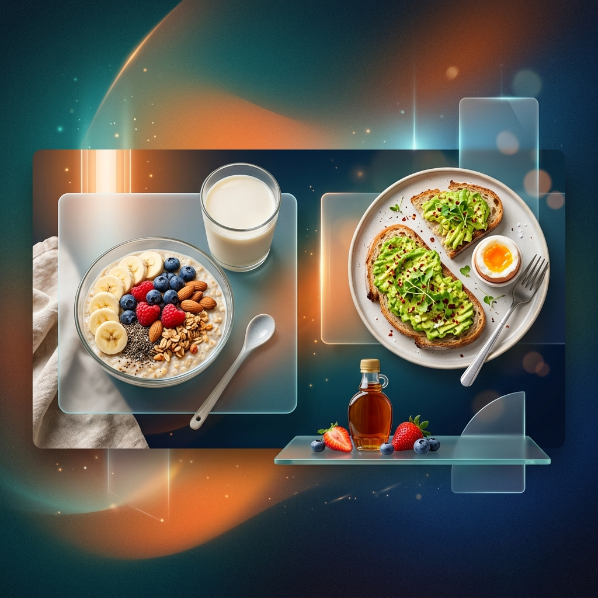

<div align="center">
  

  # Topic 4: The Importance of Having a Healthy Breakfast

  **University of Information Technology - English 03 (ENG03.F22.CN1.TTNT)**  
  *An interactive, high-end presentation for Group 4.*

  [](https://vuejs.org/)
  [](https://www.typescriptlang.org/)
  [](https://tailwindcss.com/)
  [](https://pages.github.com/)
  [](https://opensource.org/licenses/MIT)

</div>

<br/>

## Table of Contents
- [Overview](#overview)
- [Key Features](#key-features)
- [Tech Stack](#tech-stack)
- [Project Structure](#project-structure)
- [Presentation Agenda](#presentation-agenda)
- [Getting Started](#getting-started)
- [Controls & Shortcuts](#controls--shortcuts)
- [Team Structure](#team-structure)

---

## Overview

This project is a **premium interactive slide deck** built for our **English 03** presentation. It combines modern web technologies with advanced UI/UX principles to deliver a compelling story about health and performance.

> **Topic 4**: "The Importance of Having a Healthy Breakfast"  
> We aim to demonstrate that breakfast isn't just a meal; it's the "OS boot-up sequence" for a successful student day.

---

## Key Features

- **Dynamic Slide Engine**: Fully declarative slide configurations in `slides.ts`.
- **Glassmorphism UI**: High-end translucent interface powered by Tailwind CSS 4.
- **⚡ Progressive Reveal**: Step-by-step element rendering for high-impact storytelling.
- **📊 Interactive Components**: Custom-built `BatteryProgress`, `GlitchEffect`, and `SimpleCharts`.
- **🕵️ Presenter Mode**: Built-in "Ghost Teleprompter" and navigation sidebar.
- **🔗 URL State Sync**: Automatically preserves slide and step state across reloads.

---

## Tech Stack

| Category | Technologies |
| :--- | :--- |
| **Framework** |   |
| **Logic** |   |
| **Styling** |   |
| **Build & Host** |   |

---

## Project Structure

```text
src/
├── components/          # Specialized UI components (Slide layouts, Battery, etc.)
├── data/
│   ├── slides.ts        # THE SINGLE SOURCE OF TRUTH (Content config)
│   ├── scripts.ts       # Presenter scripts for every slide
│   └── members.json     # Team data
├── index.css            # Global tokens and Tailwind directives
├── App.vue              # Slide Engine Core & Layout logic
└── main.ts              # Entry point
```

---

## Presentation Agenda

1.  **Scientific Health Benefits** (Phước Thịnh) - *Metabolism and nutrient intake.*
2.  **Mental & Physical Performance** (Chí Thanh) - *The "20% Brain Rule" and energy crashes.*
3.  **Consequences of Skipping** (Hoàng Sơn) - *Technical debt for your health.*
4.  **Practical Prep Tips** (Đức Ý) - *Quick healthy upgrades for busy students.*

---

## Getting Started

### 1. Installation

Ensure you have [Node.js](https://nodejs.org/) and [pnpm](https://pnpm.io/) installed.

```bash
pnpm install
```

### 2. Run Locally

```bash
pnpm dev
```

### 3. Adding Content

Simply modify `src/data/slides.ts`. The engine automatically handles rendering and navigation based on your configuration.

---

## Controls & Shortcuts

| Action | Keyboard Shortcut |
| :--- | :--- |
| **Fullpage Toggle** | `Cmd + P` (Mac) / `Ctrl + P` (Win) |
| **Next Step** | `Space`, `Enter`, `Right Arrow` |
| **Previous Step** | `Left Arrow` |
| **Exit Fullscreen** | `ESC` |
| **Ghost Teleprompter** | `Cmd + O` (Mac) / `Ctrl + O` (Win) |
| **TP Opacity** | `Ctrl + Shift + Up / Down` |
| **TP Font Size** | `Ctrl + Shift + Plus / Minus` |

---

## Team Structure (Group 4)

| Member | Primary Role |
| :--- | :--- |
| **Thanh Hải** | Team Leader, Slide Content & Closing |
| **Phước Thịnh** | Research & Health Benefits Analysis |
| **Chí Thanh** | Tech Lead, Slide Engine & Performance Section |
| **Hoàng Sơn** | Risk Assessment & Consequences Section |
| **Đức Ý** | UX Design & Practical Tips Section |

<br/>

<div align="center">
  <i>Built with love by Group 4 - UIT English 03.</i>
</div>


